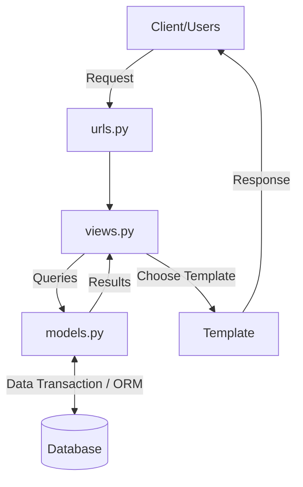

# Tugas 2 PBP

## LINK DEPLOY

https://yotugas1.herokuapp.com/

## Bagan dan Penjelasan Request Client

Penjelasan: Pertama, user meminta request ke server, request yang masuk ke dalam server django akan diproses melalui urls django lalu urls aplikasi yang kemudian akan dilanjutkan ke views.py. Request akan diproses dalam views.py. Apabila terdapat proses yang perlu untuk melibatkan database, views.py akan memanggil query ke models untuk meminta data dari database kemudian mengembalikan data tersebut ke views.py. Kemudian, views.py akan memetakan hasil pemroresannya pada template html. Setelah itu, html mengembalikan/menampilkan halaman web ke user sebagai response.

## Kenapa menggunakan virtual environment?
Virtual environment singkatnya dapat dikatakan sebagai sebuah tools memisahkan proyek-proyek yang berbeda dengan membuat semacam ruangan terpisah untuk setiap proyek. Dengan virtual environment, kita dapat mencegah error yang mungkin muncul dari program/proyek yang ingin kita buat. Contoh, kita memiliki dua project, project yang pertama menggunakan django versi 3.2, dan project yang kedua menggunakan django versi 4.1. Jika kita mengerjakan project di atas tanpa menggunakan virtual environment tentunya akan selalu muncul error tiap kita ingin mengerjakan project yang berbeda karena kita harus menyesuaikan versi dari project django yang kita miliki dengan versi requirement project yang kerjakan. Akan tetapi, dengan virtual environment, kita dapat mengatasi hal tersebut. Dengan virtual environment, kita dapat mengatur proyek-proyek yang sedang kita kerjakan dengan lebih baik dan teratur.

## Langkah Implementasi
1. Clone repository yang sudah diberikan
2. Menyalakan virtual environment
3. Menginstall libraries yang dibutuhkan pada requirements.txt
4. Mempersiapkan migrasi skema model ke dalam database django lokal
5. Menerapkan skema model yang telah dibuat ke dalam database django lokal
6. Memasukkan intial_data.json ke database django lokal
7. Membuat fungsi pada views.py yang akan memproses request dan mengembalikan katalog.html
8. Menghubungkan models, views, dan html.
9. Routing dengan menambahkan path urlpatterns pada urls.py yang terdapat di dalam folder project_django dan aplikasi katalog
10. Memastikan aplikasi berjalan dengan runserver
11. Setelah memastikan bahwa aplikasi dapat berjalan, push ke github
12. Terakhir deploy aplikasi di Heroku
